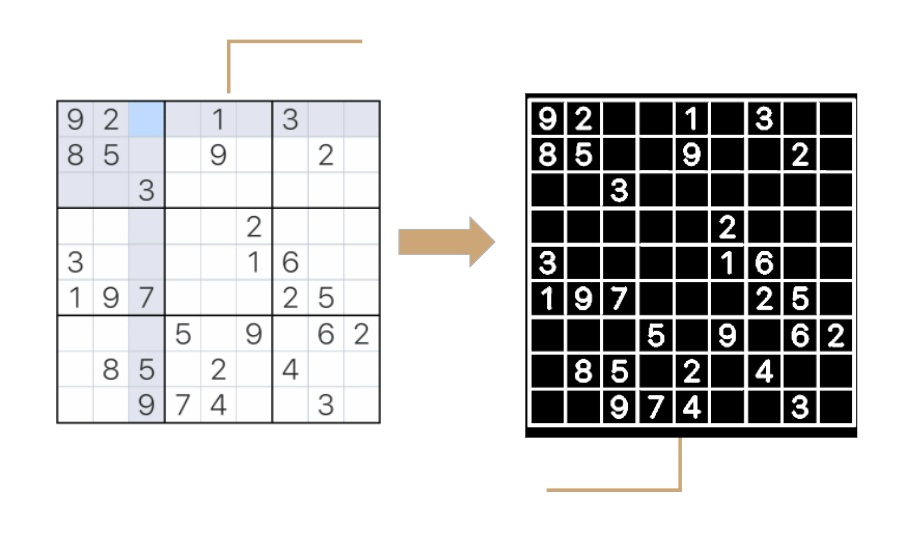
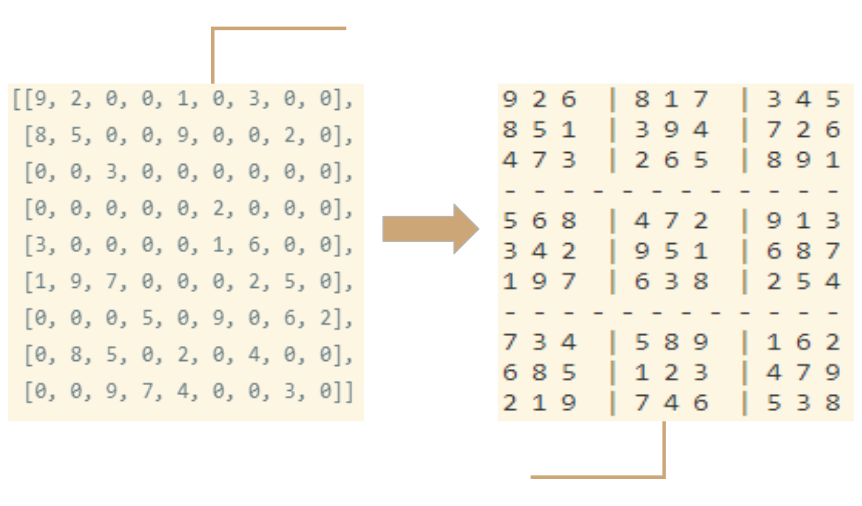

# Sudoku-Solver
A project to solve sudoku puzzles (and to help me practice SOLID design principles, feedback would be greatly appreciated).

#### Recognizing the Board
Using this bit from the OpenCV docs,  
*"Contours can be explained simply as a curve joining all the continuous points (along the boundary), having same color or intensity. The contours are a useful tool for shape analysis and object detection and recognition."*  

<p align="center">
</img>  
</p>

We can assume the board is the largest contour in the image and find the corners to extract the grid.  
Before we find the sontours some image preprocceing sters need to be done to ensure accuracy; greysclaing, blurring, thresholding, and dilation.  
Once the vertices of the contour have been retereved then we will do a K-means cluster for 4 clusters and use their centers as the 4 corners of the graph.  

<p align="center">
</img> 
</p>

#### Recognizing the numbers
Once the grid has been located we can roughly get the grid-boxes by evenly splitting the grid into 81 9x9 boxes. A convolutional neural network will be used to recognize the numbers. It has 4 convolutional layers, 2 pooling layers, and 2 fully-connected layers. The full architecture and training process can be found in digit_recognizer.py. It was trained using the MNIST digit dataset and a dataset of computer generated digits.  

<p align="center">
</img> 
</p>

#### Solving Sudoku
Sudoku can be solved by one by one assigning numbers to empty cells. Before assigning a number, check whether it is safe to assign. Check that the same number is not present in the current row, current column and current 3X3 subgrid. After checking for safety, assign the number, and recursively check whether this assignment leads to a solution or not. If the assignment doesn’t lead to a solution, then try the next number for the current empty cell. And if none of the number (1 to 9) leads to a solution, return false and print no solution exists.
#### Results  

<p align="center">
</img> 
</p>

Go to the project directory

```bash
  cd SudokuSolver
```

Install dependencies

```bash
  pip -r requirements.txt
```

Start the server

```bash
  python3 main.py
```
#### Final words
Some future improvements I can see now:
1. It would have been more reliable to use a ConvNN to locate the board. That would however require a labeled dataset of sudoku images which I presently don't have.
2. Back tracking works to solve sudoku all the time but a more efficient method exist using linear optimization. It doesn't work all the time but it could be used first then backtracking sould be a fallback option.
3. Will be revisiting this project to improve the documentation, system design, testing, and error handling.
